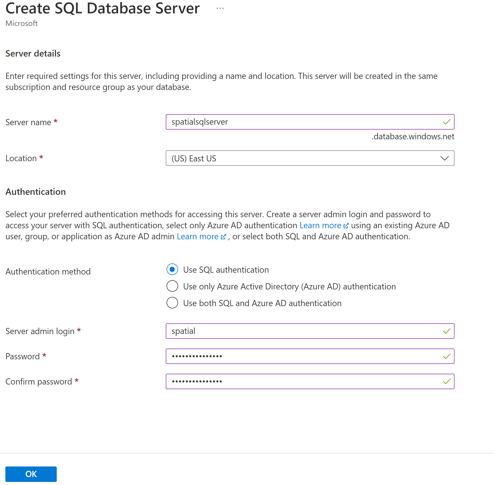
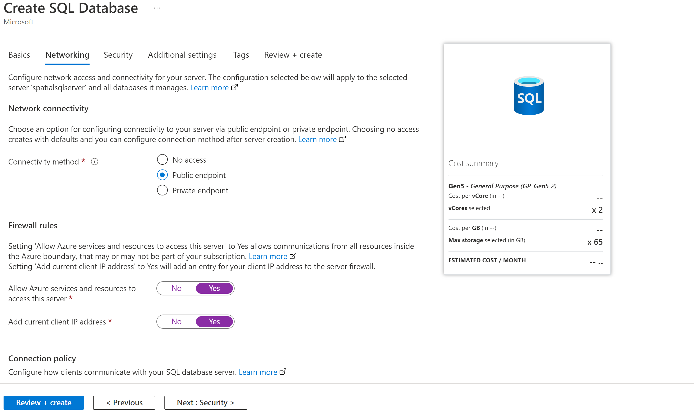
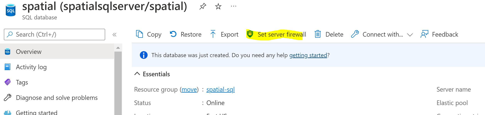
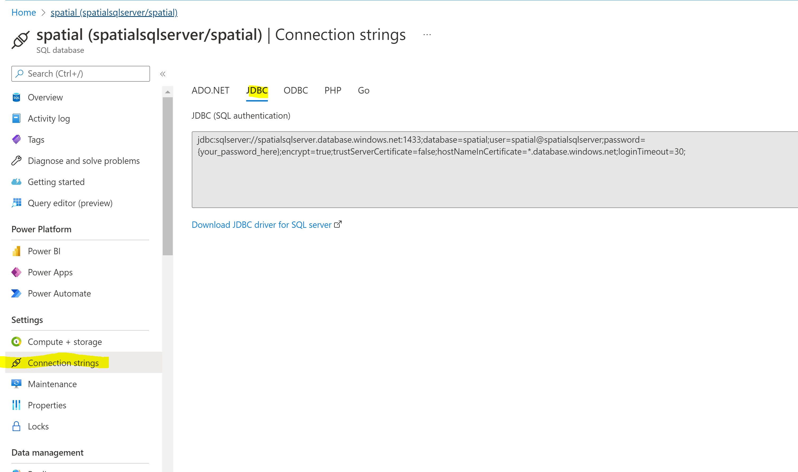

# Create Azure SQL server


---
**NOTE**\
To achieve the best performance, try to keep the database instance in the same region as the AKS cluster

---

In Azure portal, Create a resource → Databases → SQL Database → Single server\
Select single server → Create


Resource group → Create new → spatial-sql\
Database name → spatial\
Server → Create new (or select existing server)

-   Create new
    -   Server name → spatialsqlserver
    -   Location → same as rest of resources being selected for this
        deployment for performance i.e. (US) East US
    -   Authentication method → Use SQL authentication
    -   Server admin login → spatial
    -   Password → Default123 (password can be set to anything)




Compute + storage → select storage depending on the use case

Networking 
  - Connectivity method → Public endpoint
  - Allow Azure services and resources to access this server → Yes
  - Add current client IP address → Yes



Review + Create\
Create...

#### create/change firewall rules



After deployment, go to the resource, Set server firewal → Firewall
rules → add current IP (or [+ Add 0.0.0.0 -
255.255.255.255]()), → Save


#### Go to the resource and check the connection strings



---
**NOTE**
we will use the following JDBC information to do the deployment in later steps in section 4.4
```yaml
jackrabbit:
  database:
    id: "mssql"
    url: "jdbc:sqlserver://spatialsqlserver.database.windows.net:1433;selectMethod=cursor;authentication=SqlPassword;Database=spatial;encrypt=false;trustServerCertificate=true"
    user: "spatial@spatialsqlserver"
    password: "Default123"
```

---

\
\
\
NAVIGATION:

- [Getting Started - Spatial Cloud Native: Azure AKS](README.md)
- [Next Step -> Step 2: Prepare AKS cluster](prepare_aks_cluster.md)