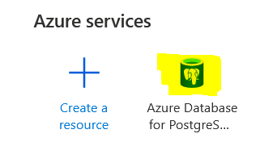
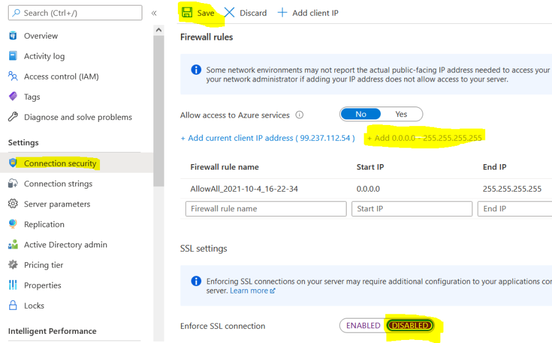
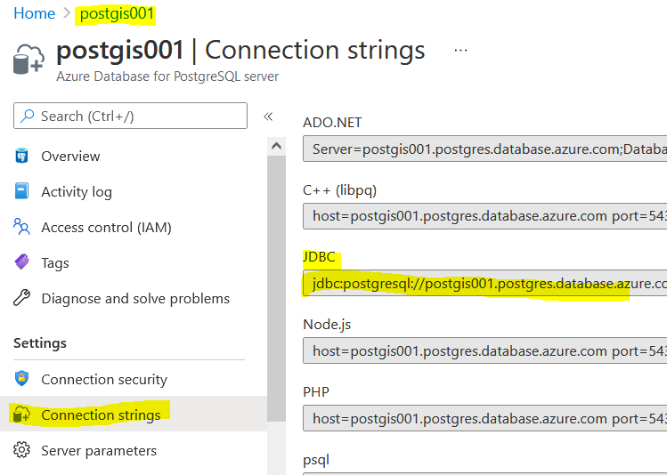
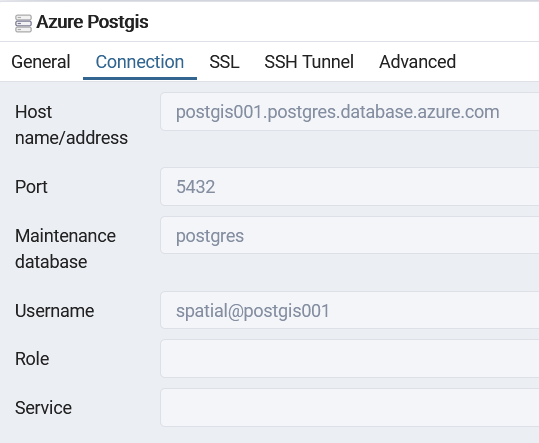
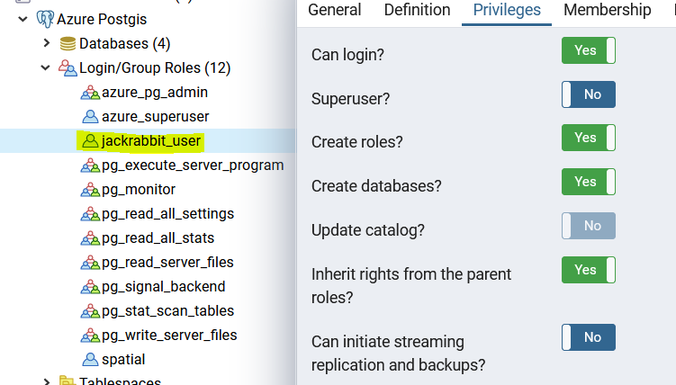
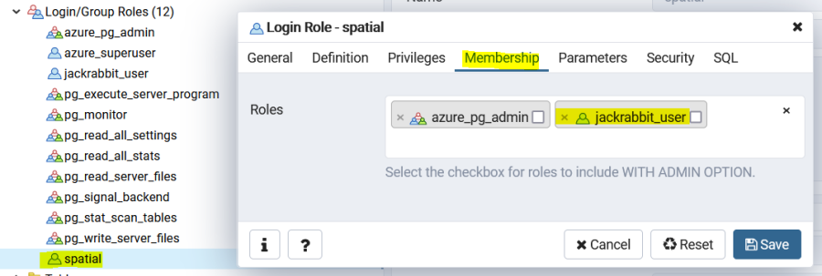
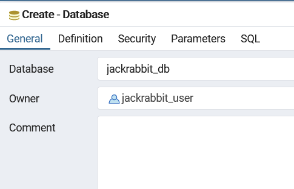

# Create Azure database for PostgresSQL

-   [1.2 Create a new database for repository](#CreateAzuredatabaseforPostgresSQL-1.2Createanewdatabaseforrepository)
-   [1.3 Install PostGIS extension (optional)](#CreateAzuredatabaseforPostgresSQL-1.3InstallPostGISextension(optional)(TODO-clarification:againstjackrabbit_db?))


If you have already got a Postgres database that is accessible through
the public Internet, you can move to the next step (1.2).



---
**NOTE**\
To achieve the best performance, try to keep the database instance in the same region as the AKS cluster

---


In Azure portal, Create a resource → Databases → Azure Database for
PostgreSQL → Single server
\
\
Select single server → Create\
Resource group → Create new → spatial-postgis\
Server name → postgis001\
Config server → basic\
Admin username → spatial\
Password → xxxxxx\
Create...

#### Connection Security

After deployment, go to the resource, set:\
Enforce SSL connection → disable\
Connection security → add current IP (or [+ Add
0.0.0.0 - 255.255.255.255], → Save




Go to the resource and check the connection strings




```
jdbc:postgresql://postgis001.postgres.database.azure.com:5432/{your_database}?user=spatial@postgis001&password={your_password}&sslmode=require
```

### Open database in pgAdmin4 from your local PC 
##### (create a server with the host and credentials)




## 1.2 Create a new database for repository

### Create a user
we will use pgadmin4 to create a user which can login.

Create a user: `jackrabbit_user` with password: `Mapinfo123` (password can be set to anything)

update privileges:\
Can login -> Yes\
Super User -> No\
Create roles -> Yes\
Create databases -> Yes\
Inherit rights from the parent roles -> Yes



### Add `spatial` user to the membership of `jackrabbit_user`




### Create a database `jackrabbit_db` with `jackrabbit_user` as the owner.



Now you should be able to connect to the database (jackrabbit_db/public) through jdbc,

---
**NOTE**
we will use the following JDBC information to do the deployment in later steps in section 4.4
```
jackrabbit:
  database:
    id: "postgres"
    url: "jdbc:postgresql://postgis001.postgres.database.azure.com:5432/jackrabbit_db?currentSchema=public"
    user: "jackrabbit_user@postgis001"
    password: "Mapinfo123"
```

---


## 1.3 Install PostGIS extension (optional)

You can skip this if you do not plan to use the same Postgres instance
to serve spatial data.

#### find available extensions

following query will display available extensions with versions

```
SELECT * FROM pg_available_extensions;
```

i.e. `Postgis 2.5.1`

#### 

``` 
CREATE EXTENSION Postgis SCHEMA public; SELECT PostGIS_Version();
```
`2.5 USE_GEOS=1 USE_PROJ=1 USE_STATS=1`


Now you should be able to upload TAB files using MapInfo EasyLoader to
this spatial enabled database (postgres/public).

\
\
\
NAVIGATION:

- [Getting Started - Spatial Cloud Native: Azure AKS](README.md)
- [Next Step -> Step 2: Prepare AKS cluster](prepare_aks_cluster.md)