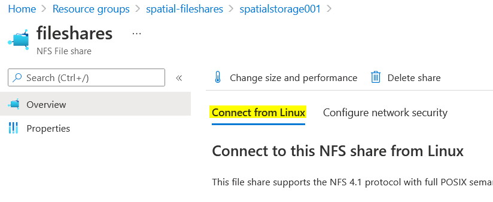
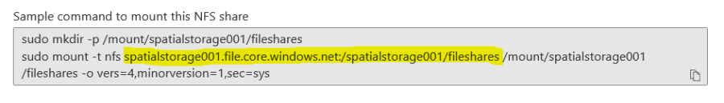

# Create PersistentVolume (PV) and PersistentVolumeClaim (PVC)

In Cloud Shell, clone SpatialAnalytics repository.

```shell
git clone https://github.com/PreciselyData/SpatialAnalytics.git
```

```shell
cd SpatialAnalytics/deploy/azure-aks
```


### Create PV from the Fileshares

If you used different names of resource group and storage account, find
out the actual NFS server name and path as below and update the template
before creating PV, otherwise, you can skip the following part.\
In Azure portal, go to the 

spatialstorage001 → Fileshares → fileshares

#### Find connection server info for fileshares



After clicking on `Connect from Linux` it should display with information that can be used to mount Fileshares. 
we need server information so we can update `fileshare-pv.yaml`.




In Cloud Shell, update the server and path in `fileshare-pv.yaml` if
needed,

**fileshare-pv.yaml**

```yaml
apiVersion: v1
kind: PersistentVolume
metadata:
  name: data-volume
  labels:
    app: spatial
spec:
  capacity:
    storage: 100Gi
  volumeMode: Filesystem
  accessModes:
    - ReadWriteMany
  storageClassName: ""
  mountOptions:
    - hard
  nfs: #update server name and or path as needed based on storage creation
    server: spatialstorage001.file.core.windows.net
    path: /spatialstorage001/fileshares
```

In Cloud Shell, create the PV from the template file (making sure your
current directory is `SpatialAnalytics/deploy/azure-aks`)

```shell
kubectl apply -f fileshare-pv.yaml
```

To verify

```shell
kubectl get pv
```

```shell
NAME          CAPACITY   ACCESS MODES   RECLAIM POLICY   STATUS      CLAIM   STORAGECLASS   REASON   AGE
data-volume   100Gi      RWX            Retain           Available                                   13s
```


### Create PVC from the Fileshares PV

In Cloud Shell, create the PVC from the template file

**fileshare-pvc.yaml**
```yaml
apiVersion: v1
kind: PersistentVolumeClaim
metadata:
  name: data-volume-claim
spec:
  accessModes:
    - ReadWriteMany
  storageClassName: ""
  resources:
    requests:
      storage: 100Gi
  selector: 
    matchLabels: 
      app: spatial
```

```shell
kubectl apply -f fileshare-pvc.yaml
```
\
\
To verify

```shell
kubectl get pvc
```
```shell
NAME                STATUS   VOLUME        CAPACITY   ACCESS MODES   STORAGECLASS   AGE
data-volume-claim   Bound    data-volume   100Gi      RWX                           15s
```

\
Make sure the PVC is bound to the PV successfully.

\
\
\
NAVIGATION:

- [Getting Started - Spatial Cloud Native: Azure AKS](README.md)
- [Next Step -> Step 5: Prepare and deploy using helm charts](prepare_and_deploy_using_helm_charts.md)
