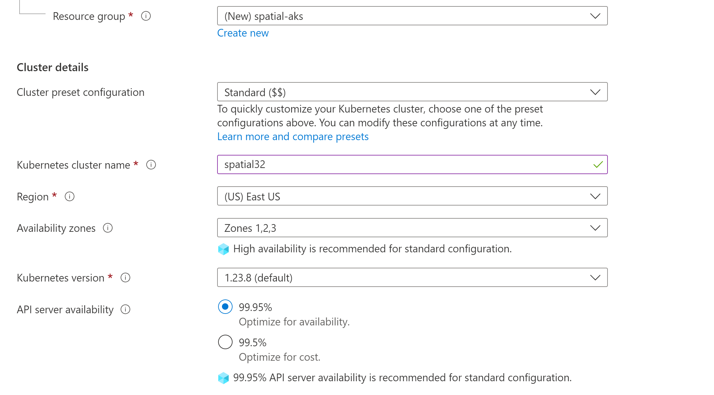

# Prepare AKS cluster

-   [2.1 Create an AKS cluster](#Step2:PrepareAKScluster-2.1CreateanAKScluster)
-   [2.2 Connect from Cloud Shell VM to the AKS
    cluster](#Step2:PrepareAKScluster-2.2ConnectfromCloudShellVMtotheAKScluster)
    -   [2.2.1 Enable Azure Cloud
        Shell](#Step2:PrepareAKScluster-2.2.1EnableAzureCloudShell)
    -   [2.2.2 Set kubectl context to AKS
        cluster](#Step2:PrepareAKScluster-2.2.2SetkubectlcontexttoAKScluster)
-   [2.3 Install Ingress-NGINX
    controller](#Step2:PrepareAKScluster-2.3InstallIngress-NGINXcontroller)

---
**NOTE**\
Select K8S version between (1.22.x - 1.23.x). Make sure the correct version is
defined for cluster creation.

---

Also see\
[https://docs.microsoft.com/en-us/azure/aks/kubernetes-walkthrough-portal](https://docs.microsoft.com/en-us/azure/aks/azure-files-volume)\
[https://docs.microsoft.com/en-us/azure/aks/ingress-basic](https://docs.microsoft.com/en-us/azure/aks/concepts-storage)

## 2.1 Create an AKS cluster


\
Default Spatial-Cloud-Native deployment will need 30 vCPUs + 15GB RAM.
It is good to start from a single node AKS cluster with `F32s_v2` VM. It
has 32 vCPUs + 64GB RAM.


In Azure portal, Create → Create a Kubernetes Cluster


### Specify information for cluster



Create a new Resource group `spatial-aks` for this AKS cluster

Kubernetes cluster name -> `spatial32`\
Kubernetes version -> `1.23.8`\
Node size -> Change size -> F32s_v2\
Scale method -> `Manual`\
Node count -> `1`

---
**NOTE** Create tag if you want to manage resource usage by application tag

---


Create the AKS cluster (It may take some time to get provisioned).

##  2.2 Connect from Cloud Shell VM to the AKS cluster

####  2.2.1 Enable Azure Cloud Shell

\
We use Azure Cloud Shell (VM) as a bridge to manage the cluster and move
data to the Fileshares. It also can be done from your local PC by other
tools. You can skip this step if you know how to do that.\
At the home page of Azure portal, click on the Azure Cloud Shell icon
(next to the search field), following the instructions to enable the
Bash (you may need to create a storage Fileshares if you are first time
using the Cloud
Shell).

##### Open Cloud Shell 


##### Bash Shell


---
**NOTE** in the Bash windows, you can use ctrl-c to copy and shift-insert
to paste.

---

###  2.2.2 Set kubectl context to AKS cluster

\
In Azure portal, go to 

spatial-aks → spatial32,
and click on `Connect`

to find the commands to add the context to kubectl.


---
**Note** az command is bound to a subscription, if the resource group is
not in the current subscription, then need to switch.) Open the Cloud
Shell

---

Clicking on `Open Cloud Shell` will also run the both az commands automatically and reset the cloud 
shell if it was already open

```shell
az account set --subscription 385ad333-7058-453d-846b-xxxxxxxxx
```

```shell
az aks get-credentials --resource-group spatial-aks --name spatial32
```

```shell
kubectl config use-context spatial32 && \
kubectl config current-context
```

\
\
Now kubectl is set default to the AKS spatial32 cluster. You can check
the status of the nodes

```shell
kubectl get nodes
```

```shell
NAME                                STATUS   ROLES   AGE    VERSION
aks-agentpool-39271417-vmss000000   Ready    agent   106s   v1.23.8
```


###  2.3 Install Ingress-NGINX controller

---
**NOTE** If you would like to setup TLS for HTTPS traffic follow official azure docs: https://docs.microsoft.com/en-us/azure/aks/ingress-tls?tabs=azure-cli

---

\
In the Cloud Shell,

```shell
helm repo add ingress-nginx https://kubernetes.github.io/ingress-nginx
helm repo update
kubectl create ns ingress-nginx
helm install ingress-nginx ingress-nginx/ingress-nginx -n ingress-nginx
```

\
\
Now ingress controller is installed. Check out the load balancer
external IP address that will be used to access the spatial services
from Internet (it may take a minute to become available).

```shell
kubectl get svc -n ingress-nginx
```

```shell
NAME                                 TYPE           CLUSTER-IP     EXTERNAL-IP    PORT(S)                      AGE
ingress-nginx-controller             LoadBalancer   10.0.5.175     23.96.127.58   80:31943/TCP,443:32142/TCP   45h
ingress-nginx-controller-admission   ClusterIP      10.0.134.147   <none>         443/TCP                      45h
```

---
**NOTE** make sure to make a note for `EXTERNAL-IP=23.96.127.58` we will be needing this for later steps

---

\
\
\
NAVIGATION:

- [Getting Started - Spatial Cloud Native: Azure AKS](README.md)
- [Next Step -> Step 3: Setup Azure File shares](setup_azure_file_shares.md)
