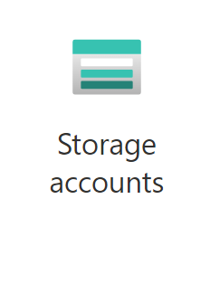
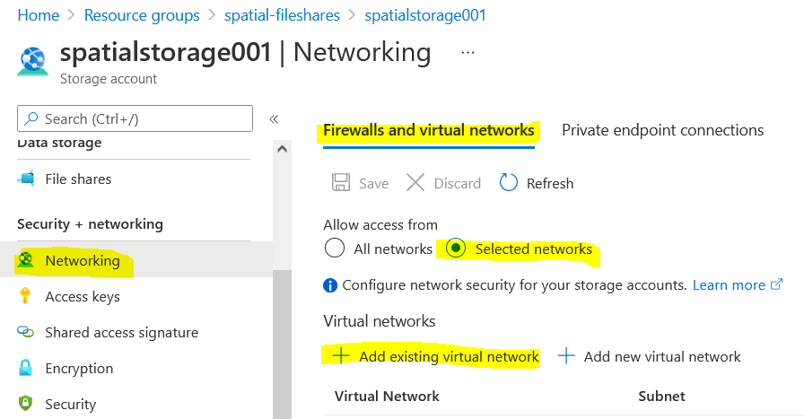
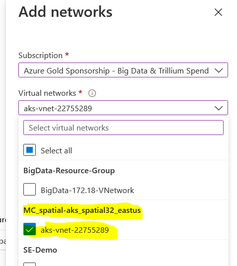
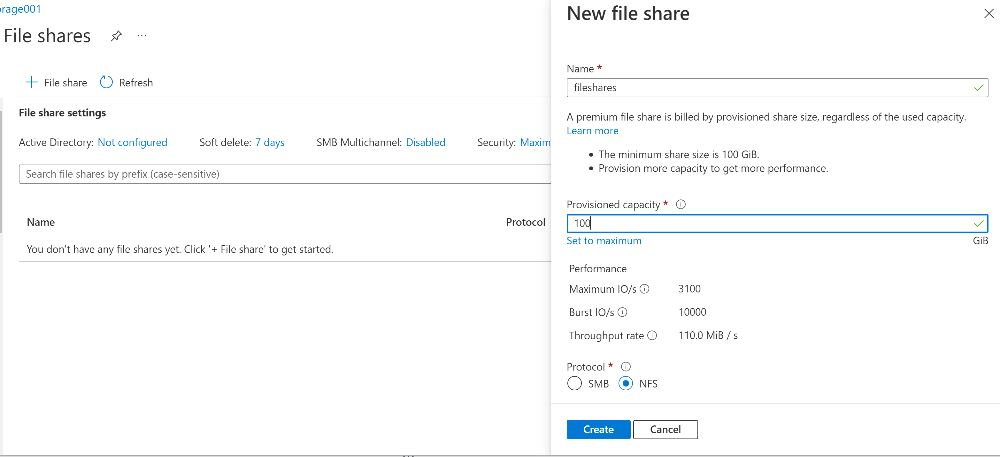

# Setup Azure File shares


By default, Azure File shares use SMB protocol that doesn't perform
well with Spatial-Cloud-Native deployment. We recommend the NFS protocol.

Also, see:\
[https://docs.microsoft.com/en-us/azure/cloud-shell/overview](https://docs.microsoft.com/en-us/azure/storage/files/storage-files-scale-targets)\
[https://docs.microsoft.com/en-us/azure/aks/azure-files-volume](https://docs.microsoft.com/en-us/azure/cloud-shell/overview)\
[https://docs.microsoft.com/en-us/azure/vs-azure-tools-storage-explorer-files](https://docs.microsoft.com/en-us/azure/vs-azure-tools-storage-explorer-files)\
[https://docs.microsoft.com/en-us/azure/storage/files/storage-files-scale-targets](https://helm.sh/docs/chart_template_guide/values_files/)\
[https://docs.microsoft.com/en-us/azure/storage/files/storage-troubleshooting-files-performance](https://docs.microsoft.com/en-us/azure/storage/files/storage-troubleshooting-files-performance)

###  3.1 Register the NFS feature to Subscription ID

To use the NFS Fileshares, the feature needs to be registered to your
Subscription ID first.

```shell
az feature register --name AllowNfsFileShares --namespace Microsoft.Storage --subscription 78f8b96e-f0bf-47a9-81b6-xxxxxx
```

\
\
It may take an hour to get approved. Check and wait until the state
becomes "**Registered**",

```shell
$az feature show -name AllowNfsFileShares --namespace Microsoft.Storage --subscription 78f8b96e-f0bf-47a9-81b6 xxxxxx
```

```shell
{
"id": "/subscriptions/78f8b96e-f0bf-47a9-81b6-xxxxxx/providers/Microsoft.Features/providers/Microsoft.Storage/features/AllowNfsFileShares",
"name": "Microsoft.Storage/AllowNfsFileShares",
"properties": {
"state": " Registered"
},
"type": "Microsoft.Features/providers/features"
}
```


### 3.2 Create a Storage Account for Fileshares




Storage Account → Create\
Resource group → Create new → `spatial-fileshares`\
Storage account name → `spatialstorage001`\
Select performance → `Premium`\
Select Premium account type → `File shares`

Advanced → Security → Require secure transfer for REST API operations
to allow HTTP → `Uncheck`\
Click -> `Review + Create`\
Click -> `Create`

###  3.3 Configure virtual network

\
In Azure portal, go to spatial-fileshares → spatialstorage001, select
Networking,\



Add existing virtual network from the resource group of spatial32 AKS
cluster, so AKS cluster can access the NFS Fileshares.



And select the subnets, Enable..., Add...\
Save ...

##  3.4 Create a Fileshares

In Azure portal, go to

Home -> Resource Group -> spatial-fileshares ->
spatialstorage001 -> File shares



Add a Fileshares\
Give a name `fileshares`

Specify Provisioned capacity to 100GB (The size defines the cost and
performance, check out the number of Maximum IO/s below it). The
capacity can be enlarged after creation. Select the NFS protocol

Create the Fileshares.

\
\
\
NAVIGATION:

- [Getting Started - Spatial Cloud Native: Azure AKS](README.md)
- [Next Step -> Step 4: Create PersistentVolume (PV) and PersistentVolumeClaim (PVC)](create_pv_pvc.md)
