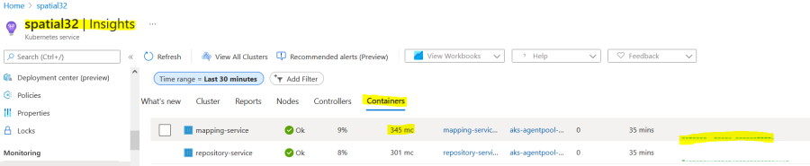

# Verify Deployment

**5. Verify the deployment** You can send any REST request to the
services through a web browser to verify if the services are working
fine. Here are a few sample requests for your convenience. To access
services, use the load balancer external IP address obtained in section
2.3.

---
**NOTE** Depending on deplyment URL prefix maybe https or http

---

| Service | URL                                                                                                                                                  |
| ------- |------------------------------------------------------------------------------------------------------------------------------------------------------|
| Spatial Manager | http://\<external-IP\>/SpatialServerManager                                                                                                          |
| Mapping requests | http://\<external-IP\>/rest/Spatial/MappingService/maps/Samples/NamedMaps/DCWashMap/image.png;w=640;h=480;c=-77.0,38.9,epsg:4326;z=5%20mi;r=96       |
| Feature requests | http://\<external-IP>/rest/Spatial/FeatureService/tables/features.json?q=SELECT Capital FROM "/Samples/NamedTables/WorldTable" WHERE Country='Canada' |
 | Tiling requests |  http://\<external-IP>/rest/Spatial/MapTilingService/Samples/NamedTiles/WorldTile/2/1:1/tile.png |
| Geometry requests | http://\<external-IP>/rest/Spatial/GeometryService?q=coordinateTransform&responseFormat=json&destinationSrs=epsg:32617&geometry=%7B%22type%22%3A%20%22LineString%22%2C%20%22coordinates%22%3A%20%5B%5B102.0%2C%200.0%5D%2C%20%5B103.0%2C%201.0%5D%2C%20%5B104.0%2C%200.0%5D%2C%20%5B105.0%2C%201.0%5D%5D%7D |
| Repository WebDAV | http://\<external-IP>/RepositoryService/repository/default |

Table 1 includes some performance results for your referencing.\
Table 1. Response time (seconds) of Rendering DCWashMap with 1 pod only

| Threads                             | 1 |2      | 4      | 8 |
|-------------------------------------| ----- | ------ | ---- | ---|
| Azure with Standard Fileshares SMB  | 5.174 |7.216  | 7.166  | 8.508|
| Azure with Premium Fileshares SMB   | 3.675 |4.980  | 4.553  | 4.688|
| Azure with Premium Fileshares NFS   | 1.440 |1.634  | 1.732  | 1.633|
| Azure with PostGIS 2.5 (Basic)      | 4.179 |4.320  | 5.001  | 8.112|
| K8 cluster                          | 1.738 |1.762  | 2.004  | 2.421|
| Spectrum Spatial 20.1               | 0.606 |0.662  | 0.973  | 1.662|

---
**Note** the results were collected from different environments.

---

#### Monitoring from Azure AKS

\
\
\
NAVIGATION:

- [Getting Started - Spatial Cloud Native: Azure AKS](README.md)
- [Next Step -> Step 7: Enabling security AKS AuthN/AuthZ](Enabling_security_AKS___AuthN_AuthZ.md)
