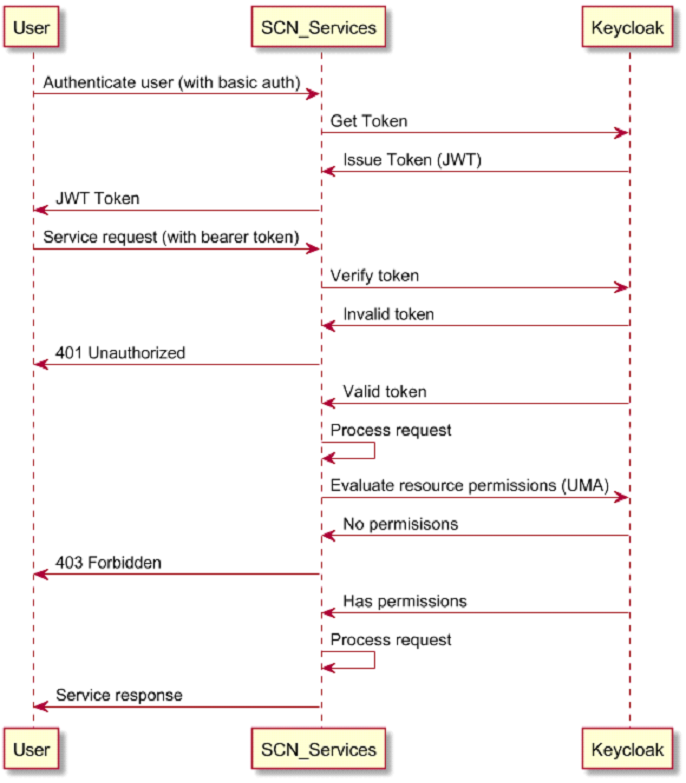

## Enabling security - AuthN/AuthZ

A `Keycloak` (18.0.0+) is used for authentication and authorization. 
- Authenticate a user
- Issue JWT token for an authenticated user
- Verify the JWT token used in a service request
- Resource based authorization
- Manage users(realm)/roles(client)
- Federate with other IDPs

General service flow,




Keycloak should have KC_HTTP_RELATIVE_PATH and KC_HOSTNAME_PATH set to ‘/auth’. SCN is compatible with Keycloak version 18.0.0 ~ 24.0.1. For a production deployment, a multi-node Keycloak cluster is recommended. Here is a link to [Keycloak Install](https://www.keycloak.org/operator/installation), [Keycloak User Guides](https://www.keycloak.org/guides)

If you have a Keycloak instance that can be accessed from inside the Kubernetes cluster, then collect the issuer url for further service config. 

If you don't have a Keycloak instance available currently, for your convenience, you can deploy a Keycloak for testing by following the first step below, otherwise, you can skip the step.


### Deploy Keycloak by helm chart for testing

Identify the external loadbalancer host to expose the Keycloak Management Console UI
```
kubectl get svc -n ingress-nginx
```
looking for the EXTERNAL-IP in the output for the value of `hostname` used in the next command.

```
helm install keycloak ~/SpatialAnalytics/charts/keycloak-standalone -n keycloak --create-namespace --set hostname=<ingress external ip> 
```
Wait until `keycloak` pod is up and ready (`kubectl get pod -n keycloak`). It may take some time for Ingress to be deployed.
    
Open a browser and login to keycloak console with the admin credentials (default to admin/admin) at
`http://<ingress external ip>/auth`

Note: this keycloak server is running in DEV mode, only use HTTP to login to admin-console.

### Create a realm for spatial services

SCN has a realm template (realm-spatial.json) that helps to setup the required realm configuration and spatial client settings. SCN authenticate with realm users and authorize with spatial client roles and resource permissions. All resource permissions (ACLs) are managed in spatial client through UMA API.

Download `~/SpatialAnalytics/deploy/realm-spatial.json` to your local system.
In the administration console, click on realm pulldown menu and select `Create realm`

Click on `Browse...` button, select the realm file `realm-spatial.json`, give a name to the new realm (use all lowercase name, e.g. `development`) and click the `Create` (do not double clicks).

After imported the realm from the template, use Keycloak Admin console to change admin ccredentials, default user credentials and spatial client secret. 

Keycloak Admin console is used to manage users in realm and roles in spatial client. SCN do not use realm roles.

also see Keycloak document about the [Management Console](https://www.keycloak.org/docs/latest/server_admin/)


### Update service config to use your realm in the keycloak
```
kubectl edit cm spatial-config
```
Update the following properties with the values below,
```
...
oauth2.enabled: "true"
oauth2.issuer-uri: "http://<ingress external ip>/auth/realms/<your realm name>"
oauth2.client-id: "spatial"
oauth2.client-secret: "fd17bc1d-cefc-41a3-8c50-bb545736caa6"
spring.security.oauth2.resourceserver.jwt.issuer-uri: "<ingress external ip>/auth/realms/<your realm name>"
...
```
Note: the property `oauth2.required-authority` restricts service access to the users who have at least the ’user’ client role by default. It can be configured to any spatial client roles. A value "" will disable the restriction.

Restart all services to pick up the configuration changes
```
kubectl rollout restart deployment
```
Wait for all pods are ready
```
kubectl get pod
```

Login to Spatial Manager when all services are ready. Initial password for `admin` is `Spatialadmin0`

`https://<your external ip>/SpatialServerManager`

Verify if you can preview a map in Spatial Manager.

Please follow the user guide for how to apply permissions and other security related topics.

### IDP Federation
Keycloak Federation allows you to authenticate users from your own IDP (such as LDAP) and map user roles to spatial client roles for authorization. Referring to Keycloak documents for the details.


### [Next Step](../spatial-utilities.md)